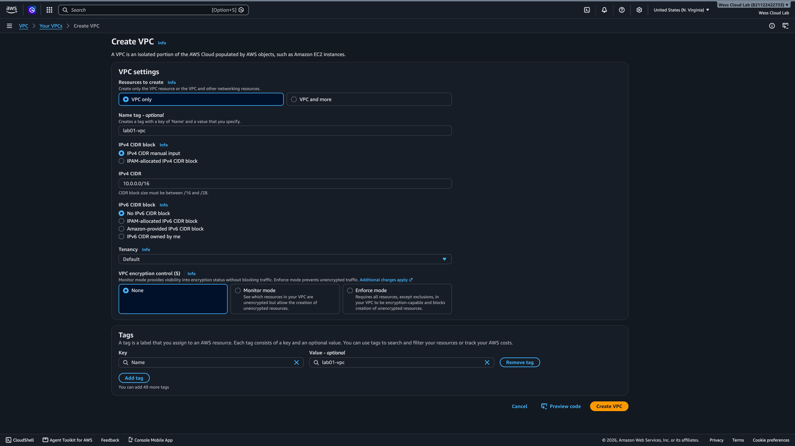
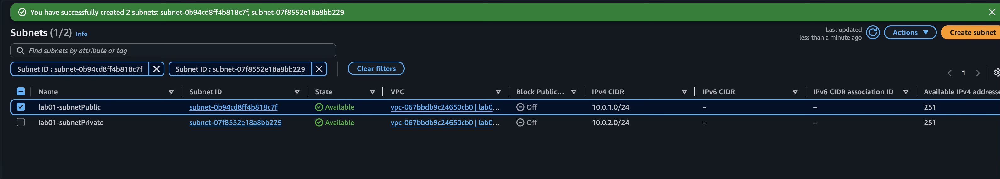
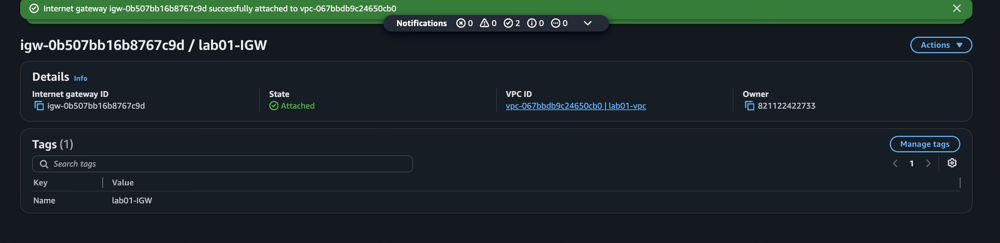
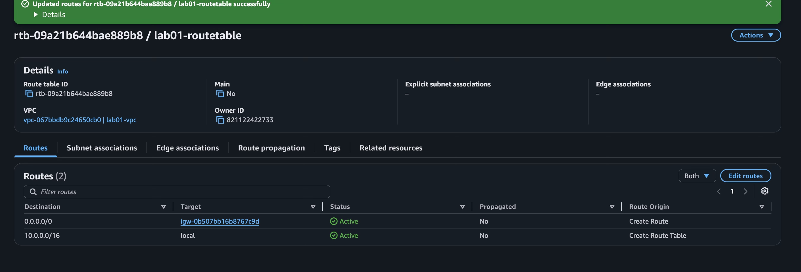
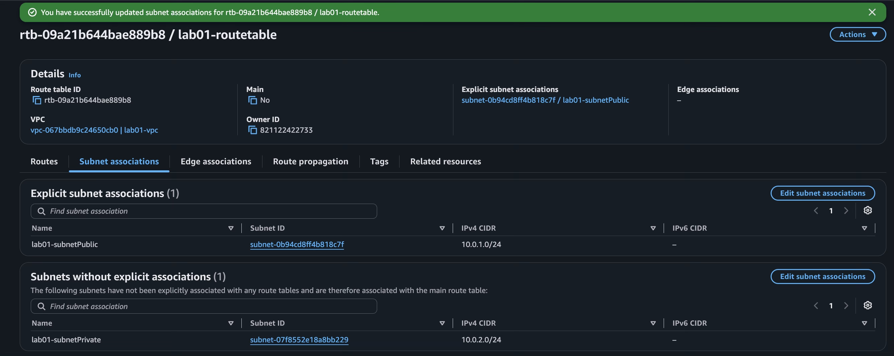

# VPC Basics

## What this lab builds

A VPC (`lab01-vpc`, CIDR `10.0.0.0/16`) with two subnets — a public subnet
(`10.0.1.0/24`) and a private subnet (`10.0.2.0/24`) — an Internet Gateway attached to
the VPC, and a custom route table with a `0.0.0.0/0` route pointing at the Internet
Gateway, associated only with the public subnet. The private subnet stays on the VPC's
default (main) route table, which has no route to the internet.

Public subnets are paired with route tables that are connected/associated with an
Internet Gateway. The Internet Gateway is exactly what it sounds like — it's the
gateway to the internet. The private subnet uses the other route table, the one that's
not connected to the Internet Gateway, but resources can still communicate with it
locally within the VPC.

## Steps taken

1. Created the VPC in the AWS Console — searched VPC, chose "VPC only" (not "VPC and
   more," which auto-generates subnets/route tables and would've skipped the actual
   rep), named it `lab01-vpc`, CIDR `10.0.0.0/16`.

   

2. Created two subnets: `lab01-subnetPublic` (`10.0.1.0/24`) and `lab01-subnetPrivate`
   (`10.0.2.0/24`).

   

3. Created an Internet Gateway (`lab01-IGW`) and attached it to `lab01-vpc`.

   

4. Created a route table (`lab01-routetable`) in `lab01-vpc`, added a `0.0.0.0/0` route
   targeting the Internet Gateway, then went into "Edit subnet associations" and
   explicitly associated it with `lab01-subnetPublic` only. `lab01-subnetPrivate` was
   left alone, so it stays on the main route table.

## What broke (and why)

The route table's subnet association didn't actually save the first time. Both
subnets showed up under "subnets without explicit associations" — meaning both were
still effectively private (falling back to the main route table) even though I
thought I'd already associated the public subnet.

Had to go back into "Edit subnet associations" and explicitly check
`lab01-subnetPublic` before it actually took effect. Good reminder that until a
subnet is explicitly associated with a route table, it silently falls back to Main —
the subnet's name doesn't change that.

## What I learned

After creating the VPC I was able to reflect and gain some understanding of the
different building blocks associated with creating a VPC — the different
configuration for each one. Setting the CIDR block, setting up the subnets, the route
table, the Internet Gateway — seeing how they connect. Definitely going to run
through it again to get some reps in, but I'm seeing the full picture of how it's
created, and a few more reps with exercises like this is really going to drill it
down to where whipping up a VPC becomes easier.

The CIDR block calculations before we even touched the console helped a lot going in.
Then walking through creating the VPC step by step was good, but mostly I was just
able to get my hands dirty and make mistakes. Glad I went the extra mile with
screenshots — that revealed things I missed that I got to go back and correct. Those
corrections matter because as I get better, I'll be able to catch these mistakes on
the fly, on this project and future ones — identifying issues quickly before I've
even finished creating the VPC or subnet or whatever it is.

Getting my hands dirty with each block of the VPC and reflecting on it after building
it made me feel more confident in the VPC creation process overall.
