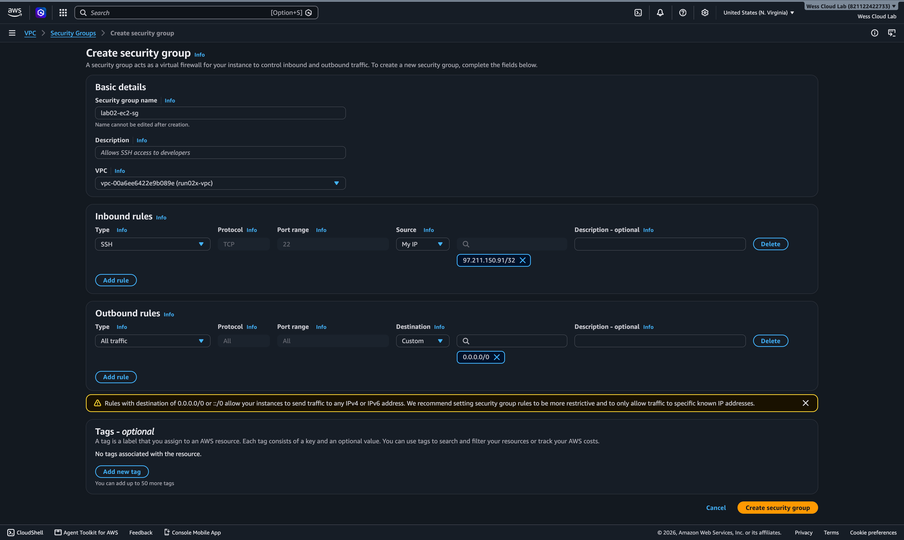
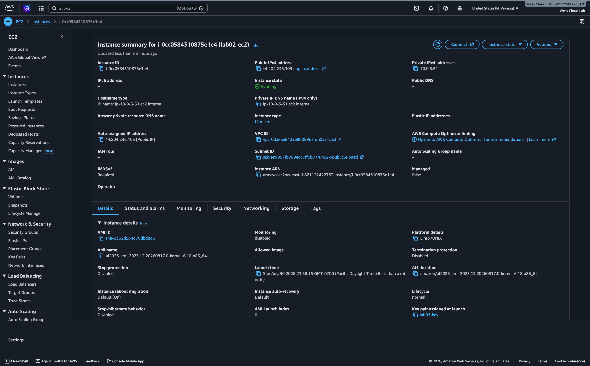
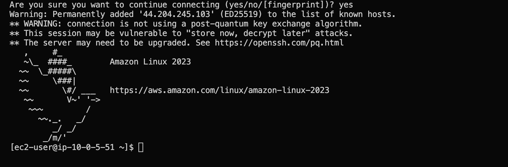
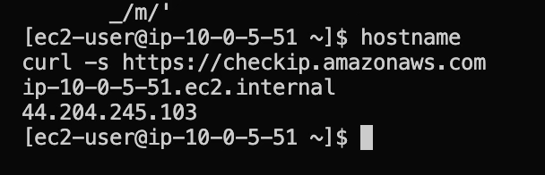
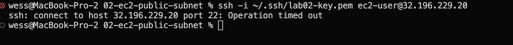

# EC2 in a Public Subnet

## What this lab builds

An EC2 instance launched into the public subnet from lab 01 (`run02x-vpc` →
`run02x-publicSubnet`), reachable via SSH from a single trusted IP and able to reach
the internet outbound. New concept versus lab 01: a **security group** — an
instance-level firewall, separate from the subnet-level route table mechanism that
controlled public/private in lab 01. The SSH rule is scoped to exactly one address
using a `/32` CIDR block (zero free bits, the smallest possible block) — a direct
callback to the CIDR math from lab 01's drilling.

## Steps taken

**Demo pass (CLI), 2026-08-30:**
1. Verified the account was clean (no running EC2/RDS) before starting.
2. Created security group `lab02-ec2-sg` in `run02x-vpc` — inbound rule: SSH (22)
   from my own public IP as a `/32`.
3. Created SSH key pair `lab02-key`, saved the private key to `~/.ssh/` — outside the
   git repo, never committed (leaking a key into git history isn't a "delete and
   move on" mistake — it stays recoverable from history).
4. Launched a `t2.micro` into `run02x-publicSubnet` with an explicit public IP (the
   subnet's auto-assign setting was off, unlike what a fully "VPC and more" wizard
   would've defaulted to).
5. Verified both directions: SSH connected in successfully, and `curl` from inside
   confirmed outbound internet access.
6. Terminated the instance, deleted the security group, ran the full account-wide
   sweep to confirm nothing was left running.

**Guided console walkthrough, 2026-08-31:** repeated the same build in the AWS
Console instead of CLI, step by step.

- Created the same security group via the console's "My IP" auto-fill — it landed on
  the exact same IP as the manual `curl` check from the CLI pass, good confirmation
  the two methods agree.
- Launched via the console UI, reusing the existing `lab02-key` key pair.

- Connected via SSH from the terminal and ran the same two verification checks.

- Torn down again afterward (terminate instance → delete security group), verified
  clean via CLI.

**Independent build (Rebuild pass, unaided), 2026-09-01:** built from memory —
security group, launch, SSH connect — using earlier passes in this README as
reference material rather than a fresh checklist. Verified correct via CLI before
teardown: right VPC/subnet, right key pair, security group scoped to exactly one
`/32`. Torn down and confirmed clean afterward, same as the prior two passes.

**Reject/timeout side quest, 2026-09-09:** after a quick warm-up rebuild + teardown
for review, built one more instance — same pattern, but this time attached to a
security group with **no inbound rule at all**, specifically to see the failure case
instead of only the success case.

- Attempted SSH against it: no fingerprint prompt, no response of any kind — just a
  multi-minute delay, then `Operation timed out`.
- Added the SSH rule back to the same security group, tried again: connected
  immediately, ran the same `curl` outbound check as before.
- Torn down (instance → security group), verified clean via CLI.

## What broke (and why)

Hit an SSH connection error caused by a typo in the command. While troubleshooting,
started creating a second key pair and tried to get it attached to the already-
running instance — that doesn't actually work, since an EC2 instance's key pair is
fixed at launch time and can't be swapped afterward through normal means (the real
workarounds — injecting a new public key via user-data, EC2 Instance Connect, manual
edits from inside the OS — are all more advanced than anything needed here). Went
back to the original key pair, compared the SSH command against an earlier working
version, found the typo, and connected successfully — without asking for help on it,
even though I almost did.

## What I learned

Security groups being a separate, instance-level gate from lab 01's subnet-level
routing is clearer now, and launching an EC2 instance feels more familiar than it
did. Understanding is coming slowly rather than all at once, and it's still a little
fuzzy without more to react against — specifically, I've only seen the success case
so far (security group correctly configured, connection works), not the failure case
(security group missing the rule, connection actually gets rejected). Seeing that
rejected-connection case side by side with the working one would probably complete
the picture better than more successful runs will.

**Follow-up, after the reject/timeout side quest:** it clicked once I actually saw
it — the blocked attempt tries to establish a connection, gets no response because
the security group just drops the packets, and there's no "connection refused"
notification, only a timeout after waiting. So the practical takeaway for real
troubleshooting going forward: if an SSH connection ever hangs and times out instead
of failing immediately, the first thing to go check is the **security group's
inbound rules** — that delay-then-timeout pattern specifically points at something
being silently blocked, not an application-level problem.
